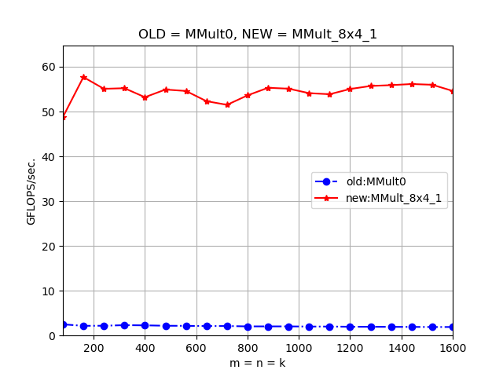
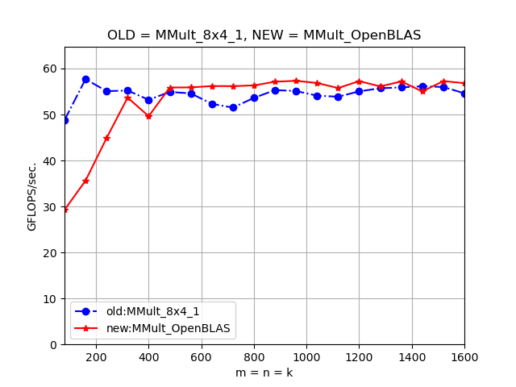

General Matrix Multiplication (GEMM) is a fundamental operation optimized by [BLAS libraries](https://en.wikipedia.org/wiki/Basic_Linear_Algebra_Subprograms#Level_3). It evaluates the expression
**C** := α **AB** + β **C**, where **A**, **B**, and **C** and matrices with floating-point elements. This repository optimizes a simplified version **C** := **AB** on Apple Silicon, with specific parameters optimized for the M3 processor.

# Forked from How To Optimize Gemm
https://github.com/flame/how-to-optimize-gemm

Wiki: https://github.com/flame/how-to-optimize-gemm/wiki

© Prof. Robert van de Geijn (rvdg@cs.utexas.edu)

# Table of contents

| Filename | Optimization |
| --- | --- |
| `MMult0.c` | Baseline triple-loop GEMM. |
| `MMult1.c` | Factors the dot product into `AddDot` and traverses C by columns. |
| `MMult2.c` | Unrolls the N dimension to compute four output columns per iteration. |
| `MMult_1x4_3.c` | Introduces a 1×4 microkernel made from four dot products. |
| `MMult_1x4_4.c` | Inlines the dot-product work into the 1×4 microkernel. |
| `MMult_1x4_5.c` | Merges four inner loops to compute four dot products concurrently. |
| `MMult_1x4_6.c` | Accumulates in registers and reuses the loaded A element. |
| `MMult_1x4_7.c` | Replaces indexed B access with advancing column pointers. |
| `MMult_1x4_8.c` | Unrolls the K loop by four. |
| `MMult_1x4_9.c` | Uses base-plus-offset addressing in the unrolled K loop. |
| `MMult_4x4_3.c` | Introduces a 4×4 microkernel using sixteen scalar dot products. |
| `MMult_4x4_4.c` | Inlines the sixteen dot products. |
| `MMult_4x4_5.c` | Merges the dot-product loops into a 4×4 outer-product update. |
| `MMult_4x4_6.c` | Keeps the 4×4 accumulators and A values in registers. |
| `MMult_4x4_7.c` | Uses pointers to traverse B's four columns. |
| `MMult_4x4_8.c` | Caches the current B row in registers. |
| `MMult_4x4_9.c` | Rearranges the scalar kernel for vectorization. |
| `MMult_4x4_10.c` | Vectorizes the 4×4 kernel with SSE-to-NEON intrinsics. |
| `MMult_4x4_11.c` | Adds M and K cache blocking. |
| `MMult_4x4_12.c` | Packs A panels into contiguous memory. |
| `MMult_4x4_13.c` | Reuses each packed A panel across output-column blocks. |
| `MMult_4x4_14.c` | Packs B panels into contiguous memory. |
| `MMult_4x4_15.c` | Reuses a static packed-B buffer across M blocks. |
| `MMult_4x4_16.c` | Uses explicit fused multiply-add operations. |
| `MMult_4x4_17.c` | Replaces the compatibility layer with direct NEON and unrolls K by two with independent accumulators. |
| `MMult_4x4_18.c` | Tunes block sizes and reschedules loads and FMAs. |
| `MMult_8x4_1.c` | Expands the microkernel to 8×4 and aligns packed buffers to 64 bytes. |

# Comparisons
### Against naive implementation

### Against OpenBLAS (single-threaded)

